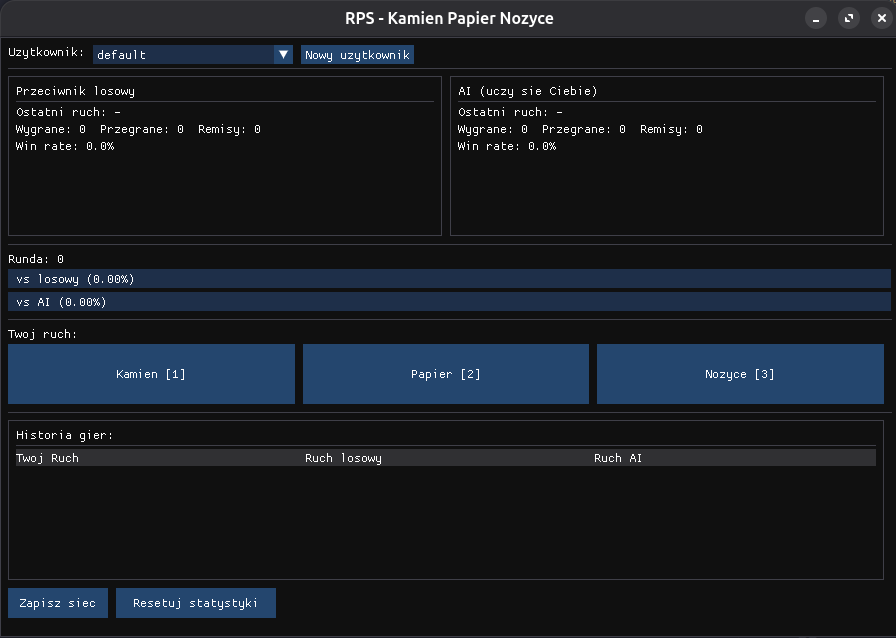

[English](README.en.md) | [Polski](README.md)

# RPS — kamień, papier, nożyce z uczącym się AI

Gra, w której grasz jednocześnie z dwoma przeciwnikami: **losowym** (punkt odniesienia)
i **AI**, które uczy się Twoich nawyków i próbuje je wykorzystać. Interfejs w Dear ImGui + SFML.

Sieć neuronowa jest napisana od zera w C++ (bez bibliotek ML) — warstwy gęste, ReLU,
propagacja wsteczna, optymalizator Adam, uczenie online po każdej rundzie.



<!-- ## Jak działa AI

Ruch wybiera **zespół predyktorów**, nie sama sieć:

- **sieć neuronowa** — wejście to one-hot z ostatnich rund (ruch gracza + ruch AI), wyjście to
  rozkład nad następnym ruchem gracza; ruch AI wybierany przez wartość oczekiwaną,
- **tabelki zliczeń** — częstościowa, Markow rzędu 1 i 2, oraz warunkowana wynikiem
  poprzedniej rundy (łapie odruch „po przegranej zmieniam"); uczą się po ~30 rundach,
  czyli dużo szybciej niż sieć,
- **predyktor losowy** z wynikiem przypiętym do zera — bezpiecznik: gdy wszystkie wzorce
  zawodzą (człowiek czyta bota), AI przechodzi na grę losową i nie da się zejść poniżej ~33%.

Każdy predyktor dostaje co rundę **zanikającą ocenę formy** (wygrana +1, przegrana −1,
remis 0, mnożone przez 0.9), a do gry wchodzi ten aktualnie najlepszy.

Profile użytkowników są zapisywane w `users/` (wagi sieci + tabelki), a nowy profil startuje
z wytrenowanego ziarna `data/seed.txt`, żeby nie zaczynać od zera. -->

## Wymagania

```bash
sudo apt install build-essential pkg-config libsfml-dev
sudo apt install g++-mingw-w64-x86-64      # tylko dla wydania na Windows
```

## Komendy

```bash
make               # zbuduj grę -> bin/rps
make run           # zbuduj (w razie potrzeby wygeneruj ziarno) i uruchom
make clean         # wyczyść artefakty budowania

make seed          # przetrenuj ziarno dla nowych profili -> data/seed.txt
make seed-eval     # ziarno bez przeciwników held-out (tylko do uczciwych porównań)

make benchmark     # zbuduj narzędzie testowe -> bin/benchmark
make windows       # cross-kompilacja statycznego .exe -> precompiled/windows/
make linux-dist    # wydanie linuksowe -> precompiled/linux/
make precompiled   # oba wydania naraz
```

**Ważne**: po zmianie architektury sieci (rozmiary warstw, `histryWindow`, `encodeSize`)
usuń stare profile z `users/` i przegeneruj ziarno (`make seed`) — format zapisu nie zawiera
nagłówka z wersją, więc stare pliki wczytają się jako śmieci.

## Benchmark

Rozgrywa AI przeciwko zaskryptowanym profilom gracza (stały ruch, cykle, win-stay/lose-shift,
ludzka „losowość", gracz zmieniający taktykę co kilkanaście rund, gracz kontrujący bota)
i podaje procent wygranych. Szybciej i powtarzalniej niż klikanie w UI.

```bash
./bin/benchmark                              # 1 przebieg, z rozbiciem na okna czasowe
./bin/benchmark --repeats 20                 # 20 przebiegów, uśrednione podsumowania
./bin/benchmark --repeats 20 --seed data/seed.txt   # start z ziarna zamiast losowej sieci
./bin/benchmark --repeats 20 --seed users/tymo.txt  # ocena konkretnego profilu

./bin/benchmark --train-seed data/seed.txt            # trening ziarna (pełna mieszanka)
./bin/benchmark --train-seed X.txt --holdout          # bez przeciwników held-out
```

Benchmark nigdy nie modyfikuje podanego pliku i nie dotyka `users/`.

## Struktura

```
src/game/    zasady gry, losowy przeciwnik, statystyki
src/ai/      sieć (Network.h), tabelki (CountTable.h), zespół predyktorów (NeuralOpponent)
src/ui/      okno, layout, obsługa kliknięć (App)
tools/       benchmark + skrypt cross-kompilacji na Windows
third_party/ Dear ImGui i ImGui-SFML (nietykane)
```
